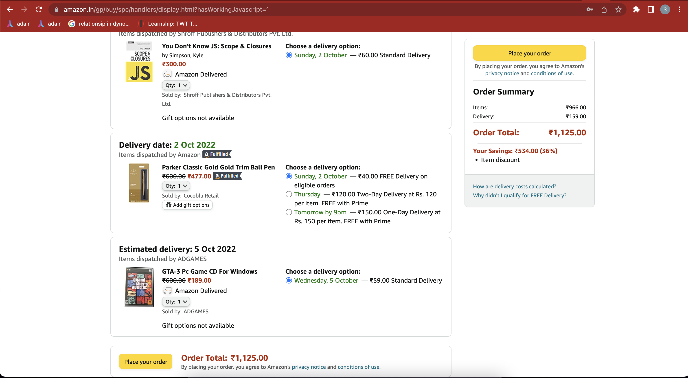

**BillCalculator**
    

   Assignment:
        1. Write a program in Java to create amazon cart
        2. to maintain different types of Goods
        3. Goods are like Book, CD, Pen
        4. Goods have common properties like name, price, isImportedOrNot, tax, isGiftOptionAvailable, seller
        5. Each item has different properties like 

           1. Book has Softcopy version and hardcopy version, author
           2. Pen has typeOfPen like "Ink" or "Ball point"
           3. CD has type like "mp3", "planin rw"

Cart
1. Items
2. total price
3. discount
4. tax

Items
1. Item
2. Quantity

Item
1. name
2. price
3. isTaxExempt
4. isImported

Book
1. name
2. isImported
3. type
4. 